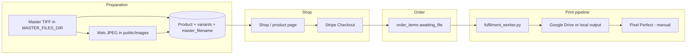
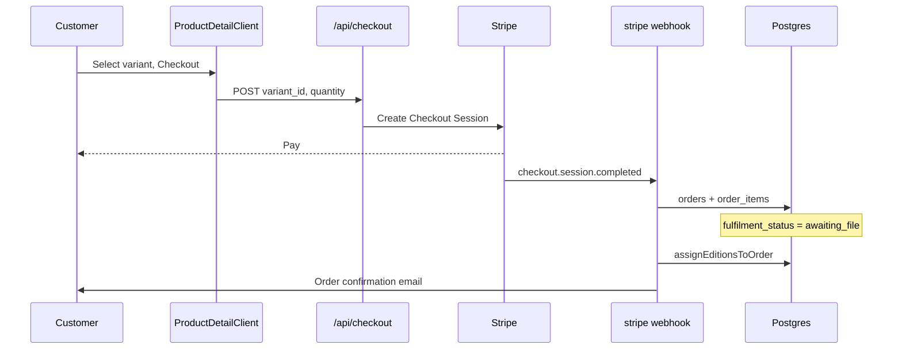

# Image and fulfilment workflow

End-to-end reference for preparing exhibition prints for the website, taking orders, and producing lab-ready files for Pixel Perfect.

## Overview



| Stage | Who / what | Output |
|-------|------------|--------|
| Register photo | Admin UI or PhotoLab API | Product, variants, web image, Stripe prices |
| Browse & buy | Customer on site | Paid `order_items` |
| Order for studio | Admin on shop / product editor | $0 `order_items` (no edition, not sales) |
| Auto print prep | Python worker | Sized Adobe RGB TIFF + `file_ready` |
| Lab & ship | Admin fulfilment dashboard | Pixel Perfect ref, tracking, emails |

---

## 1. Preparing an image for the website and shop

Customers see a **web JPEG** (`product_images.image_url`, typically `/images/...`). Print production always uses the **master TIFF** referenced by `product_variants.master_filename`.

### Master files

- Stored under **`MASTER_FILES_DIR`** (Mac: `/Volumes/AppData/Exhibition/Masters`; server: `/mnt/nas/AppData/Exhibition/Masters`).
- Dev may use **`MASTER_FILES_DIR_DEV`** when `NODE_ENV` is not `production`.
- Filename only in the database (e.g. `photo-name.tif`) — no paths. Valid extensions: `.tif`, `.tiff`.
- Masters should include an **embedded ICC profile** (required later for the print worker).

See `lib/master-files.ts` for listing and validation used by Register Photo.

### Path A: Import Wizard (guided, recommended)

| Step | Detail |
|------|--------|
| UI | `/admin/import-wizard` |
| API | `POST /api/admin/register-photo` (same as Register Photo) |
| Client | `components/admin/ImportPhotoWizardClient.tsx` |

Hard-gated steps from placing a master TIFF in `MASTER_FILES_DIR` (no browser TIFF upload) through details, **print offer** (fixed Size × Finish × Framed matrix), web image, and publish. Ends with a product online and ready for ordering.

**Happy path for sellable prints:** each product gets nine `product_variants` rows:

- Sizes: Small (420 mm) / Medium (594 mm) / Large (841 mm) long edge, aspect-true from the master
- Finishes: Archival matte (Hahnemühle Photo Rag) or Ready-to-hang canvas
- Presentation: Unframed or Framed (matte only; Standard moulding + Perspex)
- `fit_mode = custom_size`, `size_lock = long_edge`
- Matte retail = roundUp(mediaBase + mediaMarkup × area × $0.181); framed adds roundUp(frameBase + frameMarkup × (Standard+Perspex))
- Canvas retail = roundUp(mediaBase + mediaMarkup × RTH package by united inches) — package already includes print
- Shop labels like `Medium · Archival matte · Framed`
- Round up to nearest $5 under $120, nearest $10 at $120+

ISO `variant_templates` are dormant. `/admin/register-photo` redirects to Import Wizard.

Admin help for preparing masters: `/admin/help/master-tiff`.

### Path A2: Register Photo (retired)

Redirects to Import Wizard. Use Path A for all new registrations.

### Path B: PhotoLab / API registration

| API | `POST /api/products/register` |
| Auth | Bearer API key (`lib/api-key-auth.ts`) |

Same `registerPrintProduct()` as above, but the caller supplies **`web_image_url`** (already hosted). No automatic web generation on this route.

### Path C: Manual product editor

| UI | `/admin/products/new`, `/admin/products/[id]/edit` |
| Form | `components/admin/ProductEditorForm.tsx` |

Create or edit products and variants manually. Each variant can pick a **print template** to pre-fill fulfilment fields. Shop images may be added via **`POST /api/admin/upload/image`** (site/marketing images, max 5MB). For print fulfilment, variants must still have **`master_filename`** and print dimensions populated.

### What is stored where

| Asset | Role | Location |
|-------|------|----------|
| Master TIFF | Source for web gen + print worker | `MASTER_FILES_DIR` on disk |
| Web JPEG | Shop and product pages | `public/images/...` (+ optional `media_files`) |
| Variant row | Price, dimensions, paper, DPI, **`master_filename`**, offer axes (`tier_label` / `finish` / `is_framed`), framing (`fit_mode` / `size_lock`) | `exhibition.product_variants` |
| Offer pricing | Media + frame markups; frame & RTH canvas united-inch tables | `site_content` keys `print_price_*`, `print_frame_*`, `print_rth_canvas_rates` |
| Reprice all | Recalculates active offer variant prices from current factors | `POST /api/admin/print-pricing/reprice-all` |
| Rebuild all | Soft-deactivates old variants; inserts 32-SKU offer per print product (A4/A3/A2/A0 × Tier 1/2 print/mount/framed, canvas sheet/wrap) | `POST /api/admin/print-pricing/rebuild-all` |

The public site **does not** serve master TIFFs to shoppers.

---

## 2. Website display

- Shop listing: `/shop` — products where `is_available` is true.
- Product detail: `/shop/[slug]` — Size → Finish → Presentation chooser resolves one active offer variant (`ProductDetailClient.tsx`).
- Images are served as static files from `/images/...` (and similar paths under `public/`).

Supabase clients use schema **`exhibition`** for product data.

---

## 3. Customer ordering



1. Customer chooses a variant and starts checkout → **`POST /api/checkout`** (`app/api/checkout/route.ts`).
2. Redirect to **Stripe Checkout**; payment completes on Stripe.
3. **`app/api/webhooks/stripe/route.ts`** handles `checkout.session.completed`:
   - Creates **`orders`** (`status: paid`)
   - Creates **`order_items`** with **`fulfilment_status: 'awaiting_file'`**
   - Runs edition assignment
   - Sends **order confirmation** via Resend (`lib/emails/order-confirmation.ts`)

**Manual orders:** `POST /api/admin/orders/manual` also creates items in `awaiting_file`.

**Studio / artist copies:** while signed in as admin, **Order for studio** on `/shop/{slug}` or the product editor creates a $0 order (`mode: studio`). No Stripe, no edition number, excluded from sales. Worker still prepares the TIFF. On `/admin/fulfilment`, **Copy studio order email** copies one draft for every studio item still waiting for the lab (`awaiting_file` or `file_ready`): your contact and Morris Rd address once, then a section per print (no prices). Paste into an email to Pixel Perfect.

At this point **no print file exists yet** — only the database row (and Stripe payment for customer orders).

---

## 4. Print preparation (automated worker)

Print files are **not** generated inside Next.js at checkout. A **separate Python process** polls the fulfilment API.

### Configuration

See **`worker/README.md`**. Typical production env:

```bash
EXHIBITION_API_BASE_URL=https://exhibition.margies.app
EXHIBITION_API_KEY=...
MASTER_FILES_DIR=/mnt/nas/AppData/Exhibition/Masters
PRINT_OUTPUT_PROFILE_PATH=/path/to/AdobeRGB1998.icc
LOCAL_OUTPUT_DIR=/mnt/nas/AppData/Exhibition/print-output
GOOGLE_OAUTH_TOKEN_PATH=...          # optional: personal Drive OAuth token
GOOGLE_DRIVE_FOLDER_ID=...           # optional: parent folder for automatic uploads
```

`LOCAL_OUTPUT_DIR` is required and always retains a copy. Personal OAuth credentials
optionally create a Drive folder per photograph and upload the TIFF automatically. A
service account remains supported for Shared Drives via
`GOOGLE_APPLICATION_CREDENTIALS`, but cannot upload to its own My Drive because it
has no storage quota. See `worker/README.md` for the one-time OAuth setup.

`WORKER_POLL_SECONDS` defaults to 60.

Run locally with app: `npm run dev:all` (Next.js + worker).

### Worker loop (`worker/fulfilment_worker.py`)

1. **`GET /api/fulfilment/queue`** — authenticated with API key; returns items with variant/product fields including **`master_filename`**, **`width_mm`**, **`height_mm`**, **`border_mm`**, **`print_dpi`**.
2. For each item with **`fulfilment_status === 'awaiting_file'`**:
   - Resolve `MASTER_FILES_DIR / master_filename`
   - **`generate_print_file()`**:
     - Requires embedded ICC in the TIFF
     - Converts to **Adobe RGB 1998** using `PRINT_OUTPUT_PROFILE_PATH` (perceptual intent, black-point compensation)
     - Resizes with **cover crop** (default) or fills a **custom_size** rectangle; optional white border
     - Writes a flat 8-bit TIFF (ZIP/Adobe Deflate) with output ICC embedded and **dpi metadata** set to `print_dpi`
   - Copy TIFF to **`LOCAL_OUTPUT_DIR/<order>_<slug>/`**
   - Optionally create **one Google Drive folder per photograph** (`<order>_<slug>`), upload the TIFF using personal OAuth, and grant unlisted **anyone-with-link reader** access (reuse the folder for every size ordered of that photograph)
   - Store the public Drive file URL in `cloud_file_url` for the Pixel Perfect order
   - If Drive fails, retain the local copy and record a manual-upload note
   - **`PATCH /api/fulfilment/items/{order_item_id}`** → **`fulfilment_status: 'file_ready'`**, plus `cloud_file_url` / `cloud_folder_path`

Queue and updates: `lib/fulfilment-items.ts`, `lib/fulfilment-update.ts`. Admin mirror routes under `/api/admin/fulfilment/`.

### How the worker knows print size

Dimensions come from **`product_variants`** at order time (originally copied from **variant templates** at registration, or set in the product editor). The worker does not read templates directly — it reads the queue row built from the ordered variant.

---

## 5. Lab submission and shipping (manual admin)

**UI:** `/admin/fulfilment` — `components/admin/FulfilmentDashboardClient.tsx`

| Status | Meaning |
|--------|---------|
| `awaiting_file` | Paid; worker should produce upload |
| `file_ready` | Print TIFF available (Drive link or local URI) |
| `submitted_to_lab` | Pixel Perfect order reference saved |
| `shipped` | Tracking recorded; customer may be notified |
| `delivered` | Terminal state |

Typical admin flow:

1. Wait for **`file_ready`** (open `cloud_file_url`).
2. For studio copies, send the page-level Pixel Perfect email; for customer prints, use their form. Save **`pixel_perfect_order_ref`** → status **`submitted_to_lab`**.
3. When despatched, set **`tracking_number`** → **`shipped`**; optional **`/api/admin/fulfilment/notify-customer`**.

Paper type, finish, framing, and variant notes are metadata for the lab; colour space for the file is normalized to the configured output profile (normally Adobe RGB 1998).

---

## 6. Fulfilment status lifecycle

```text
awaiting_file → file_ready → submitted_to_lab → shipped → delivered
     ↑              ↑              ↑              ↑
   Stripe        Worker         Admin UI       Admin UI
   webhook       + PATCH        dashboard      dashboard
```

Timestamps: `file_ready_at`, `submitted_to_lab_at`, `shipped_at` (set on status transitions in `lib/fulfilment-update.ts`).

---

## 7. Key files

| Area | Files |
|------|--------|
| Register photo | `app/api/admin/register-photo/route.ts`, `components/admin/RegisterPhotoClient.tsx` |
| API register | `app/api/products/register/route.ts` |
| Product creation | `lib/product-registration.ts` |
| Web JPEG from TIFF | `lib/web-image-generation.ts`, `worker/generate_web_image.py` |
| Masters | `lib/master-files.ts` |
| Checkout | `app/api/checkout/route.ts` |
| Orders | `app/api/webhooks/stripe/route.ts` |
| Fulfilment API | `app/api/fulfilment/queue/route.ts`, `app/api/fulfilment/items/[order_item_id]/route.ts` |
| Print worker | `worker/fulfilment_worker.py`, `worker/README.md` |
| Admin fulfilment | `app/admin/fulfilment/page.tsx`, `components/admin/FulfilmentDashboardClient.tsx` |
| Variant templates | `exhibition.variant_templates`, admin print profiles / templates UI |

---

## 8. Environment variables (summary)

| Variable | Used for |
|----------|----------|
| `MASTER_FILES_DIR` / `MASTER_FILES_DIR_DEV` | Master TIFF location |
| `APP_ROOT` | Resolve `worker/` scripts from Next.js |
| `EXHIBITION_API_BASE_URL`, `EXHIBITION_API_KEY` | Worker ↔ app API |
| `PRINT_OUTPUT_PROFILE_PATH` | Lab output ICC (Adobe RGB 1998) |
| `GOOGLE_OAUTH_TOKEN_PATH`, `GOOGLE_DRIVE_FOLDER_ID` | Automatic personal Drive delivery |
| `GOOGLE_APPLICATION_CREDENTIALS` | Shared Drive service-account alternative |
| `LOCAL_OUTPUT_DIR` | Required retained local print output |
| Stripe / Resend vars | Checkout and emails |

---

## Related docs

- [image-and-fulfilment-workflow.pdf](./image-and-fulfilment-workflow.pdf) / [image-and-fulfilment-workflow.docx](./image-and-fulfilment-workflow.docx) — expanded operator guide (print-friendly)
- [supabase-infrastructure.md](./supabase-infrastructure.md) — database host and schema
- [supabase-multi-schema.md](./supabase-multi-schema.md) — exposing schemas to PostgREST

To regenerate the PDF/DOCX after editing the generator script:

```bash
python3 -m venv /tmp/exhibition-docs-venv
/tmp/exhibition-docs-venv/bin/pip install python-docx fpdf2
/tmp/exhibition-docs-venv/bin/python docs/_generate_workflow_doc.py
```
